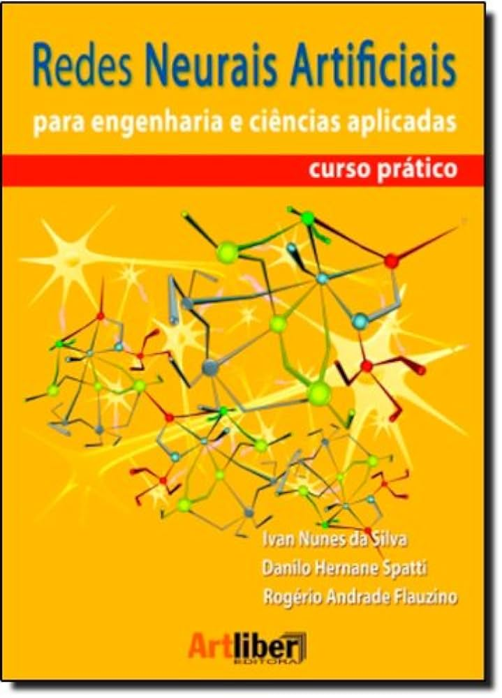

Repositório com a resolução dos Exercícios Práticos do livro **"Redes neurais artificiais para engenharia e ciências aplicadas: curso prático"** dos autores Ivan Nunes da Silva, Danilo Hernane Spatti e Rogério Andrade Flauzino, publicado pela editora Artliber, São Paulo, 2010.

**Desenvolvedor:** 
- Matheus Henrique da Silva. Control and Automation Engineering Student.
- Universidade Tecnológica Federal do Paraná, Cornélio Procópio, Paraná, Brasil. 
- E-mail: matheussilva.2019@alunos.utfpr.edu.br. 
- ID Lattes: 5450995625966991.

---

---
